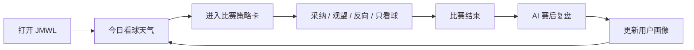

# JMWL AI 看球搭子产品方案

版本：2026-06-13.2  
状态：中文产品方向稿  
当前项目：JMWL World Cup  
长期产品：JMWL Sports

## 1. 一句话定位

JMWL 不是押注平台，也不只是赛程表。

JMWL 是一个 **AI 看球搭子**：它像天气预报一样，在赛前帮用户看懂比赛热度、胜率、市场情绪和策略风险；赛后再帮用户复盘判断，慢慢形成个人看球画像。

推荐 slogan：

> 赛前有底，赛后有谱。

辅助文案：

> 你的 AI 看球搭子，像查天气一样看比赛。

## 2. 为什么要这么做

现在项目已经有这些基础：

- 世界杯赛程。
- 球队和球员数据。
- Polymarket 市场概率。
- 本地模型胜率。
- AI 分析。
- 用户登录和预测记录。

但它现在最大的问题是：用户看完一眼胜率，为什么还要回来？

答案不是继续堆更多数据，而是要让产品记住用户：

1. 用户关注哪些比赛。
2. 用户采纳过哪些策略。
3. 用户喜欢稳健、搏冷，还是反市场共识。
4. 用户的判断有没有变好。
5. 用户赛后能不能得到反馈。

所以产品闭环应该从“查胜率”变成：

```text
赛前看球天气 -> 采纳模拟策略 -> 赛后结算 -> AI 复盘 -> 形成个人画像 -> 下次继续看
```

## 3. 产品不做什么

这个边界很重要。

JMWL 不做：

- 不收钱押注。
- 不托管资金。
- 不撮合交易。
- 不承诺盈利。
- 不说“必中”“稳赚”。
- 不把用户导向真实下注行为。

JMWL 做的是：

- 概率解释。
- 策略模拟。
- 赛后复盘。
- 看球陪伴。
- 用户个人策略画像。

一句话：

> 我们不替用户下注，只帮用户看懂比赛。

## 4. 用户场景

### 场景一：赛前 30 分钟

用户打开平台，不想看一堆复杂数据，只想知道：

- 今晚有哪些重要比赛？
- 哪场最值得看？
- 哪场有冷门可能？
- 哪场市场分歧最大？
- 我心里应该怎么预期？

产品给出“比赛天气预报”：

> 今晚 12 场里，真正值得关注的是 3 场。  
> 法国 vs 德国是实力盘，美国 vs 巴拉圭是情绪盘，韩国 vs 捷克是分歧盘。

### 场景二：看球前想有底

用户点进一场比赛，看到：

- Polymarket 市场概率。
- JMWL 模型概率。
- AI 解释。
- 风险点。
- 推荐策略。

例如：

> 法国方向有轻微价值，但不是重仓局。  
> 市场给法国 41%，JMWL 模型给 46%，Edge +5pt。  
> 稳健策略：法国不败。  
> 价值策略：法国胜。  
> 杠铃策略：小注 2-1 或 1-0。

### 场景三：模拟押注

用户不在平台上真钱下注，只是在平台上记录：

- 我采纳这条策略。
- 我观望。
- 我反向。
- 我只看球。

这里使用“单位”，不用人民币：

- 0.5 单位。
- 1 单位。
- 2 单位。

这一步让用户从“看信息”变成“形成一次决策”。

### 场景四：赛后复盘

比赛结束后，AI 告诉用户：

- 策略中了没有。
- 这次判断质量怎么样。
- 是模型错了，还是比赛随机性太强。
- 用户更适合哪类策略。

例如：

> 这场没中，但不是坏决策。  
> 模型正确识别了法国的控球优势，错在低估早段红牌对节奏的影响。  
> 你这次属于价值派选择，不建议因为单场结果改变长期策略。

### 场景五：长期看球画像

用户用久之后，平台形成画像：

- 稳健派。
- 价值派。
- 杠铃派。
- 反共识派。
- 主队信仰派。
- 情绪看球派。

例如：

> 你过去 10 次搏冷只中了 1 次，但稳健策略 7 中 5。  
> 你更适合低频、高确定性的策略。  
> 本周建议减少精确比分玩法。

这就是“AI 看球搭子”的长期价值。

## 5. 核心功能流程



## 6. MVP 功能

一个月内不要做大而全。先做能证明思路的版本。

### 6.1 今日策略页

新增一个页面，例如 `/strategy`。

它展示未来 24 小时或当前比赛日最值得看的比赛：

- 比赛时间。
- 重要程度。
- 双方球队。
- 市场概率。
- 模型概率。
- 分歧程度。
- AI 一句话总结。
- 推荐动作：看好 / 谨慎 / 观望。

这个页面是产品的入口。

### 6.2 比赛策略卡

每场比赛给出 3-4 种策略：

| 策略 | 说明 | 例子 |
| --- | --- | --- |
| 稳健策略 | 少出手，低波动 | 法国不败 / 大方向看法国 |
| 价值策略 | 模型概率高于市场概率 | 法国胜，Edge +5pt |
| 杠铃策略 | 大部分观望，小部分搏高赔率 | 小注 2-1 / 1-0 |
| 观望策略 | 没有明显优势 | 只看球，不模拟押注 |

### 6.3 模拟采纳

按钮可以是：

- 采纳策略。
- 加入观察。
- 我反向。
- 只看球。

这会写入用户记录。

### 6.4 我的策略记录

把现在的“我的预测”升级为“我的策略记录”：

- 待结算。
- 已命中。
- 未命中。
- 已观望。
- 连续命中。
- 不同策略类型表现。

### 6.5 AI 赛后复盘

赛后给用户一段复盘：

- 策略结果。
- 关键原因。
- 模型是否被验证。
- 用户画像变化。

MVP 阶段可以先半自动，不需要一开始就完全自动。

### 6.6 分享卡

生成适合发群/朋友圈/小红书的结果卡：

> 昨晚 JMWL 策略 5 中 3。  
> 我采纳 2 条，命中 1 条。  
> 本周我是稳健派。

分享卡对传播和简历项目都很重要。

## 7. AI 到底在哪里

AI 不应该只是“预测谁赢”。那样太薄，也容易显得玄学。

AI 的角色应该是 **策略导师 + 看球搭子**。

### 7.1 AI 做赛前总结

AI 把复杂信息变成人话：

> 这场值得看，不是因为两队都强，而是市场和模型分歧大。

### 7.2 AI 做策略解释

AI 解释为什么推荐：

> 市场给德国太高，JMWL 模型认为法国反击效率被低估，所以法国方向有价值。

### 7.3 AI 做劝退

这点很重要。AI 不应该每场都推荐。

它要会说：

> 这场模型和市场基本一致，没有明显优势，建议观望。

### 7.4 AI 做赛后复盘

AI 解释结果，而不是只说“中/没中”。

例如：

> 这次错在低估主力轮换，不是概率模型整体失效。

### 7.5 AI 做长期记忆

AI 记住用户：

- 喜欢哪支队。
- 喜欢稳健还是搏冷。
- 哪类策略命中率高。
- 哪类策略总是冲动。

这才是长期留存点。

## 8. 策略体系

### 8.1 稳健策略

目标：减少噪音，少出手。

适合：

- 普通用户。
- 看球前想有底。
- 不想玩太刺激的人。

规则：

- 模型和市场方向一致才推荐。
- 低信心比赛直接观望。
- 优先推荐不败、大方向、强弱明显局。

### 8.2 价值策略

目标：找市场低估。

核心逻辑：

```text
如果 JMWL 估计概率 > 市场隐含概率，就可能有价值。
```

例如：

市场认为法国胜率 41%，JMWL 模型认为 46%，那法国方向就是 +5pt Edge。

但注意：有 Edge 不等于一定会赢，只代表长期看可能更值得。

### 8.3 Kelly 策略

目标：根据胜率和赔率决定模拟单位。

Kelly Criterion 可以用来计算理论仓位，但它对概率误差很敏感，所以产品里只能用保守版本。

产品规则：

- 不展示“真钱下注金额”。
- 只展示“模拟单位”。
- 不用满 Kelly。
- 使用 1/4 Kelly 或更低。

### 8.4 杠铃策略

目标：大部分比赛保守或观望，少量比赛搏高赔率。

适合看球娱乐场景。

产品表达：

> 这场主策略观望，但如果你想搏冷，可以小单位尝试 2-1。

它的重点不是鼓励乱冲，而是把风险控制在少数策略里。

### 8.5 反共识策略

目标：识别市场过热。

例如：

- 热门球队被公众买爆。
- 市场价格涨得很快。
- 但模型和基本面没有同步支持。

AI 可以提示：

> 这场市场情绪偏热，不建议追高。

### 8.6 垄断优势策略

这个适合长期赛事和五大联赛。

它看的是结构性优势：

- 阵容深度。
- 教练稳定。
- 赛程密度。
- 伤病韧性。
- 主客场旅行压力。
- 强强对话经验。
- 市场叙事溢价。

例如：

> 法国的优势不只是单场状态，而是阵容深度在密集赛程里更稳定。市场已经部分定价，但没有完全定价轮换能力。

### 8.7 讲球策略

这个是传播玩法。

AI 帮用户把判断讲出来：

- 这场为什么重要。
- 市场怎么看。
- JMWL 哪里不同意。
- 关键变量是什么。
- 一句话怎么发群。

例如：

> 这场好看的点不是谁更强，而是市场过度相信德国控球。JMWL 认为法国反击效率被低估，所以更像一场价值盘。

这会让用户有动力“讲球”或“吹球”。

## 9. 长期怎么从世界杯迁移到五大联赛

世界杯只是冷启动场景。

后续日常看球可以这样扩展：

### 第一阶段：世界杯

目标：验证用户是否愿意使用策略卡。

关注指标：

- 有多少人看今日策略页。
- 有多少人点击采纳策略。
- 有多少人赛后回来看复盘。
- 有多少人分享战绩。

### 第二阶段：重点赛事

世界杯结束后，不要立刻覆盖所有比赛。

先做：

- 欧冠。
- 英超强强对话。
- 国家队比赛。
- 五大联赛焦点战。

产品每天不需要推 50 场，只需要精选 3-5 场。

### 第三阶段：用户关注队

让用户选择关注：

- 球队。
- 联赛。
- 球星。
- 策略类型。

例如：

> 你关注的阿森纳今晚 23:30 开赛。  
> 首发公布后，JMWL 会更新策略天气。

### 第四阶段：移动端

移动端不是把网页塞进手机。

移动端核心是：

- 今日重要比赛。
- 开赛前提醒。
- 首发后策略变化。
- 赛后复盘。
- 我的策略战绩。

移动端首页应该非常简单：

```text
今晚值得看：3 场
你关注的球队：1 场
策略变化：1 条
昨日复盘：JMWL 5 中 3，你采纳 2 中 1
```

## 10. 一个月能不能跑起来

结论：**可以跑起来，但必须控制范围。**

一个月内不要做完整移动 App，不要接全量五大联赛，不要做完整自动结算，不要做复杂社区。

一个月内可以做出一个能展示、能体验、能拿用户数据、能写进简历的 MVP。

### 10.1 一个月可交付版本

可以做到：

- 一个新的中文产品定位。
- 一个 `/strategy` 今日策略页。
- 每场比赛三策略卡。
- 用户采纳策略。
- 我的策略记录。
- 简单结算状态。
- AI 复盘文案。
- 分享卡雏形。
- 基础埋点或日志统计。

### 10.2 一个月不建议做

暂时不要做：

- 原生 iOS / Android App。
- 全量五大联赛数据。
- 真实下注账户接入。
- 完整社区。
- 自动抓取所有外部盘口。
- 完全自动的复杂赛后归因。

这些会把项目拖死。

### 10.3 推荐开发节奏

#### 第 1 周：产品重构

目标：让产品从“预测看板”变成“看球策略工具”。

任务：

- 新增 `/strategy` 页面。
- 定义比赛重要度算法。
- 定义三类策略卡。
- 改文案：少说下注，多说策略、模拟、复盘。

#### 第 2 周：用户闭环

目标：让用户能采纳策略。

任务：

- 扩展 `user_predictions` 或新增 `user_strategies`。
- 支持策略类型：稳健、价值、杠铃、观望。
- 保存用户采纳记录。
- 把“我的预测”改成“我的策略记录”。

#### 第 3 周：赛后反馈

目标：让用户回来复盘。

任务：

- 支持手动/半自动结算。
- 展示命中、未命中、待结算。
- 生成 AI 复盘文案。
- 统计不同策略类型表现。

#### 第 4 周：运营验证

目标：拿到用户数据。

任务：

- 做分享卡。
- 加基础埋点。
- 找 10-30 个朋友/球迷试用。
- 每天发“今日看球天气”。
- 收集反馈。
- 整理简历项目复盘。

## 11. 简历项目怎么写

可以写成：

> 设计并开发 AI 看球策略助手 MVP，将世界杯赛程、Polymarket 市场概率、模型胜率和 AI 分析整合为“赛前策略天气”。通过模拟采纳、赛后结算和 AI 复盘，验证用户在看球前获取决策参考的需求，并沉淀用户策略画像。

如果强调产品能力：

> 从一次性胜率查询场景出发，重构为可长期运营的 AI 看球陪伴产品。设计“赛前分析 - 模拟策略 - 赛后复盘 - 用户画像”闭环，规避真实押注合规风险，并规划从世界杯迁移到五大联赛的长期路径。

如果强调数据：

> 通过策略卡浏览率、采纳率、赛后回访率、分享率和用户反馈，验证 AI 体育策略工具的用户价值。

## 12. 成功指标

MVP 阶段不要追求 DAU 很高。

更应该看这些：

- 策略卡浏览率。
- 采纳策略率。
- 赛后复盘查看率。
- 次日/下一场比赛回访率。
- 分享卡生成率。
- 用户是否主动说“看球前会打开看一下”。

一个简历项目能拿到这些就很有说服力：

- 20-50 个真实用户访问。
- 10 个以上用户采纳策略。
- 5 个以上用户赛后回来看复盘。
- 3 个以上用户给出文字反馈。
- 能展示一条完整闭环：赛前策略 -> 用户采纳 -> 赛后复盘 -> 用户画像变化。

## 13. 最大风险

### 风险一：用户只看一次就走

解决：

- 做关注球队。
- 做赛后复盘。
- 做个人画像。
- 做开赛提醒。

### 风险二：AI 显得很玄学

解决：

- AI 不直接装神预测。
- AI 解释概率、风险和不确定性。
- AI 要会劝退。
- AI 要赛后承认错误。

### 风险三：太像博彩工具

解决：

- 全部用模拟单位。
- 不接真钱。
- 不说盈利。
- 强调看球、学习、复盘、娱乐。

### 风险四：世界杯结束后没东西做

解决：

- 从世界杯迁移到焦点赛事。
- 不做全量赛程，做每日精选。
- 让用户关注球队。
- 每周做策略周报。

## 14. 最终判断

这个项目一个月可以跑起来。

但正确目标不是“做一个完整体育平台”，而是做出一个明确的 MVP：

> 用户看球前打开 JMWL，看到今日重要比赛和策略天气，采纳一条模拟策略，赛后回来复盘，并慢慢形成自己的看球画像。

只要这个闭环跑通，即使世界杯过去，它也能迁移到五大联赛和欧冠。

长期产品不是“世界杯预测站”，而是：

> JMWL Sports：一个移动端优先的 AI 看球搭子。

