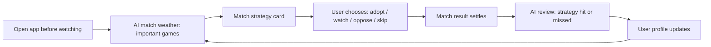

# PRD - AI Sports Watch Companion

Version: 2026-06-13.1
Status: Product direction draft
Product: JMWL Sports / JMWL World Cup

## 1. Summary

JMWL should evolve from a World Cup prediction-market dashboard into an AI sports watch companion. The product helps users decide what to watch, understand the likely outcome before kickoff, record simulated strategy choices, and review results after the match.

The first version should stay focused on World Cup matches. After proving the loop, the same product can extend to Premier League, Champions League, La Liga, Serie A, Bundesliga, Ligue 1, MLS, and national team tournaments.

Recommended slogan:

> 赛前有底，赛后有谱。

Supporting line:

> 你的 AI 看球搭子：像查天气一样看比赛。

## 2. Contacts

| Name | Role | Comment |
| --- | --- | --- |
| Lucien / qianzhu | Founder / Product owner | Defines positioning, content tone, and portfolio value for resume/project showcase. |
| Codex | Product and engineering collaborator | Helps with research, implementation, documentation, and validation. |

## 3. Background

The current product already has a strong data foundation: World Cup schedule, team/player data, Polymarket market data, Elo-style model probabilities, AI analysis, and user prediction storage.

The missing product loop is not "more prediction data." The missing loop is user memory:

1. Before watching, the user wants to know which matches matter.
2. Before kickoff, the user wants a clear probability and strategy view.
3. During decision-making, the user wants to simulate a pick without using this product as a betting platform.
4. After the match, the user wants feedback: was the strategy right, was the model wrong, or was the match just noisy?
5. Over time, the product learns the user's style and becomes a personal watch companion.

Market research supports this direction:

- Polymarket US sports docs list sports contract types such as winner, draw-aware winner, spread, total, futures, qualifiers, and player props, with official settlement rules. This means market probability can be a useful signal, but the product should not depend on every exact-score market existing. Source: [Polymarket Sports FAQs](https://docs.polymarket.us/faqs/sports-faqs).
- Polymarket's June 2026 changelog shows active World Cup liquidity incentives and soccer market type work, including moneyline, spreads, totals, team props, and player props. Source: [Polymarket US Changelog](https://docs.polymarket.us/changelog).
- MLS and Polymarket partnership coverage shows prediction markets are becoming a fan engagement layer, but also carry integrity and regulatory concerns. Sources: [ESPN](https://africa.espn.com/football/story/_/id/47737795/polymarket-mls-prediction-markets), [Front Office Sports](https://frontofficesports.com/mls-jumps-into-prediction-markets-with-polymarket-deal/).
- FotMob, Sofascore, and Flashscore already own live scores, alerts, fixtures, stats, and where-to-watch workflows. Sources: [FotMob App Store](https://apps.apple.com/sa/app/fotmob-football-live-scores/id488575683), [Sofascore App Store](https://apps.apple.com/ma/app/sofascore-live-sports-scores/id1176147574), [Flashscore App Store](https://apps.apple.com/by/app/flashscore-live-scores-news/id766443283).
- Sofascore already offers an AI football forecast and advanced match analytics feature, which proves the category is real. Source: [Sofascore AI Analyst](https://sofascore.helpscoutdocs.com/article/231-what-is-sofascore-analyst-ai-insights).
- FotMob Predict shows that score prediction and friend competition are natural football engagement mechanics. Source: [FotMob Predict](https://predict.fotmob.com/).
- Pikkit shows that users value bet tracking, social sharing, ROI, win rate, and performance breakdowns. JMWL should borrow the tracking/feedback idea but keep it as simulation and learning, not account-connected betting. Sources: [Pikkit](https://pikkit.com/), [Pikkit Bet Tracker](https://pikkit.com/bet-tracker).

## 4. Objective

Build a mobile-first watch companion that turns football matches into a daily "strategy weather" habit.

The product should not say "we help you gamble." It should say:

> We help football fans understand match probability, market sentiment, and their own decision style.

### Key Results For MVP

1. Strategy adoption: at least 25% of signed-in users who view a strategy card click "采纳策略" or "加入观察".
2. Return habit: at least 15% of users return before the next matchday after using the strategy page once.
3. Feedback loop: at least 30% of adopted strategies get viewed again after settlement.
4. Share signal: at least 5% of settled strategies produce a share card.
5. Resume proof: collect at least 20 real user feedback entries or behavior sessions showing why users did or did not trust the strategy.

## 5. Market Segments

### Primary Segment: Casual But Curious Football Fans

Job to be done:

> Before I watch a match, I want to know whether it is worth watching and what the likely story is, so I can enjoy the game with more confidence and talk about it with others.

Pain:

- Existing score apps are too event-focused.
- Betting apps are too transactional and risky.
- Public odds are hard to interpret.
- AI predictions often feel like random tips with no memory.

### Secondary Segment: Strategy-Oriented Fans

Job to be done:

> Before kickoff, I want to compare market probability, model probability, and my own intuition, so I can make a simulated strategy choice and learn from the result.

Pain:

- They want to track whether their judgment is improving.
- They want a private "paper betting" notebook.
- They do not necessarily want to connect real sportsbook accounts.

### Tertiary Segment: Content Creators / "Talk Football" Users

Job to be done:

> I want a compact pre-match view and post-match record, so I can explain matches in group chats, posts, or videos.

Pain:

- It takes time to collect fixtures, probability, odds movement, team form, and talking points.
- They need confident, shareable phrasing.

## 6. Value Propositions

### Product Positioning

JMWL is not a sportsbook. JMWL is not only a live score app.

JMWL is:

> An AI-powered match calendar and strategy weather app for football fans.

### What Users Gain

1. A curated watch list:
   - Which matches matter tonight?
   - Which matches have market disagreement?
   - Which matches are worth waking up for?

2. A clear pre-match forecast:
   - Market probability.
   - Model probability.
   - AI explanation.
   - Confidence and risk.

3. A strategy choice:
   - Conservative strategy.
   - Value strategy.
   - Barbell strategy.
   - Watch-only strategy.

4. A personal record:
   - What did I follow?
   - Did it hit?
   - Am I better at conservative picks or long-shot picks?

5. A long-term companion:
   - Favorite teams.
   - Risk personality.
   - Weekly recap.
   - AI memory.

### Why This Is Different

| Product Type | They Do Well | JMWL Difference |
| --- | --- | --- |
| FotMob / Sofascore / Flashscore | Live scores, fixtures, alerts, stats | JMWL focuses on pre-match decision context and personal strategy memory. |
| Polymarket | Market probabilities and tradable contracts | JMWL turns market probability into fan-friendly watch and strategy guidance. |
| Betting trackers like Pikkit | Real bet tracking and ROI analytics | JMWL starts with simulated strategy tracking to avoid betting-platform compliance risk. |
| Generic AI prediction tools | Picks and explanations | JMWL combines market data, model data, AI reasoning, user history, and post-match feedback. |

## 7. Solution

### 7.1 Core User Flow



### 7.2 Main Screens

#### Today - Strategy Weather

The first screen should answer:

- What should I watch today?
- Which match has the highest importance?
- Which match has the biggest probability disagreement?
- Which match is risky and should be skipped?

Example copy:

> 今晚 12 场里，真正值得看的有 3 场。美国 vs 巴拉圭是情绪盘，法国 vs 德国是实力盘，韩国 vs 捷克是分歧盘。

#### Match Strategy Card

Each match should show:

- Kickoff time.
- Watch importance.
- Market probability.
- Model probability.
- AI forecast.
- Risk flags.
- Three strategy options.

Example:

| Strategy | Meaning | Example |
| --- | --- | --- |
| 稳健策略 | Lower variance, fewer shots | France not to lose / France direction |
| 价值策略 | Model says market underprices one side | France win if model edge is positive |
| 杠铃策略 | Mostly safe or skip, small exposure to high upside | Small simulated pick on 2-1 or over 2.5 |
| 观望策略 | No clear edge | Skip and only watch |

#### Simulated Strategy Log

The user can record:

- I adopted this strategy.
- I watched only.
- I went against the AI.
- I used it elsewhere.

This should not ask for real money amount in the MVP. Use "units" instead:

- 0.5 unit.
- 1 unit.
- 2 units.

#### AI Review

After settlement, AI should explain:

- Did the strategy hit?
- Was the reasoning good?
- Was the miss caused by model error, team news, random match events, or market overreaction?
- What should the user learn?

Example:

> 这场策略没中，但不是坏决策。模型正确识别了法国的控球优势，错在低估了早段红牌对节奏的影响。你的选择属于价值派，不建议因为单场结果改变长期策略。

#### User Profile

The user's long-term profile should include:

- Strategy personality: 稳健派 / 价值派 / 杠铃派 / 反共识派 / 情绪球迷.
- Hit rate by strategy type.
- Brier score or calibration score for probability predictions.
- Favorite teams and leagues.
- Best time to send reminders.
- AI memory summary.

### 7.3 AI Mode

AI should not be framed as "a magic predictor." AI should be framed as a strategy mentor.

#### AI Responsibilities

1. Summarize match context.
2. Explain probability differences.
3. Generate strategy cards.
4. Warn when no edge exists.
5. Review after the match.
6. Update user memory.
7. Help users talk about football.

#### AI Should Not

1. Promise profit.
2. Push real-money betting.
3. Claim certainty.
4. Hide uncertainty.
5. Pretend Polymarket is always correct.

### 7.4 Strategy Models

#### Conservative Strategy

Goal: avoid noisy matches.

Rules:

- Only recommend when model and market agree on direction.
- Avoid low-confidence matches.
- Prefer winner/draw direction, double chance, or watch-only.

#### Value Strategy

Goal: find positive expected value.

Rules:

- Compare model probability with market probability.
- Flag only if edge exceeds a threshold, such as 3-5 percentage points.
- Use smaller confidence if market liquidity is low.

Formula reference:

```text
Expected Value = (Decimal Odds * Estimated Probability) - 1
```

This is the core "why" behind the product: JMWL should not recommend a match because a team is famous. It should recommend a strategy only when the estimated probability and the market price create a clear reason to act, watch, or skip.

#### Kelly Strategy

Goal: size simulated units based on edge.

Kelly Criterion is used for bet sizing when probability and odds are known. It is powerful but sensitive to probability error, so the product should use fractional Kelly for simulations. Source: [Investopedia - Kelly Criterion](https://www.investopedia.com/terms/k/kellycriterion.asp).

Simple formula:

```text
f* = p - (1 - p) / b
```

Where:

- `p` = estimated win probability.
- `b` = net odds received on a win.
- `f*` = fraction of bankroll.

Product rule:

- Never show full Kelly as a recommendation.
- Use 1/4 Kelly or lower.
- Show "unit" language, not real currency.

#### Barbell Strategy

Goal: keep most actions safe or skipped, while allowing small, high-upside simulations.

Product behavior:

- 80-90% of matches: watch-only or conservative.
- 10-20%: small simulated long-shot strategy such as exact score, high total goals, or upset.
- AI explains this as entertainment plus controlled risk.

#### Anti-Consensus Strategy

Goal: detect public overreaction.

Rules:

- Market price moved sharply without matching model or team-news reason.
- Public favorite is overheated.
- AI may recommend "fade hype" or "watch only."

#### Market Power / Moat Strategy

Goal: identify teams whose public price may not fully reflect structural strength.

This is useful for long tournaments and league seasons. The model should track durable advantages:

- Squad depth.
- Coach stability.
- Fixture congestion.
- Injury resilience.
- Home/away travel burden.
- Big-match experience.
- Public narrative premium or discount.

AI turns these factors into a plain-language view:

> 这不是单场状态问题，而是法国的阵容深度在连续赛程里更有垄断式优势。市场已经部分定价，但没有完全定价轮换能力。

This should be treated as a qualitative layer above the numerical model, not as a replacement for probability.

#### Talk-Football Strategy

Goal: help users explain a match to others.

This is the "吹球" layer. AI should generate concise talking points:

- Why this match matters.
- What the market believes.
- What JMWL disagrees with.
- What would change the strategy.
- One sentence users can share in a group chat.

Example:

> 这场好看的点不是谁更强，而是市场过度相信德国的控球优势。JMWL 认为法国反击效率被低估，所以更像一场价值盘。


### 7.5 Evaluation System

The product needs to judge probabilities, not just binary wins.

Recommended metrics:

- Hit rate: easy for users to understand.
- Simulated ROI by units: useful but should not dominate.
- Brier score: measures probability forecast quality, lower is better. Source: [Brier Score docs](https://scores.readthedocs.io/en/1.3.0/tutorials/Brier_Score.html).
- Calibration: when the model says 60%, did it happen about 60% of the time?
- Strategy-specific score: conservative, value, barbell, anti-consensus.

### 7.6 Compliance Position

JMWL should stay on the strategy-tool side.

Rules:

1. Do not accept deposits.
2. Do not execute bets.
3. Do not connect sportsbook accounts in MVP.
4. Do not promise profit.
5. Do not use "guaranteed" or "must win" language.
6. Use simulation units.
7. Add clear disclaimer: educational and entertainment analysis only.

This protects the product while keeping the most useful loop: decision, record, feedback, learning.

## 8. Release

### MVP - World Cup Strategy Weather

Timeframe: 1-2 weeks.

Features:

1. `/strategy` page: today's important matches.
2. Match importance scoring.
3. Strategy card with conservative/value/barbell/watch-only options.
4. Simulated strategy adoption.
5. My strategy log.
6. Manual or semi-automatic settlement.
7. AI post-match review template.
8. Share card for strategy result.

Primary validation:

- Do users click "采纳策略"?
- Do they come back after the match?
- Do they understand the AI explanation?
- Do they share the result?

### V1 - Personal Watch Companion

Timeframe: 3-5 weeks after MVP.

Features:

1. Favorite teams and competitions.
2. Match reminders.
3. User strategy profile.
4. Weekly recap.
5. AI chat scoped to current match and user history.
6. Better settlement and scoring.

### V2 - Five Leagues And Mobile

Timeframe: after the World Cup proof.

Features:

1. Premier League, Champions League, La Liga, Serie A, Bundesliga, Ligue 1.
2. Mobile-first UI.
3. Push notifications.
4. Calendar sync.
5. Lineup-based strategy updates.
6. Public strategy leaderboard for simulated performance.

### V3 - Community And Creator Mode

Features:

1. Shareable "talk football" cards.
2. Creator strategy portfolios.
3. Group watch rooms.
4. Follow strategy personalities.
5. Public model track record.

## Slogan Options

Recommended:

> 赛前有底，赛后有谱。

Alternative options:

1. 像查天气一样看比赛。
2. 你的 AI 看球搭子。
3. 开赛前，看一眼胜率天气。
4. 不替你下注，只帮你看懂比赛。
5. 每场球，都有一张策略天气图。
6. 看球前的最后一眼。
7. 让每场比赛都有依据。
8. 先看策略，再看比赛。
9. 用市场概率，讲清比赛故事。
10. 从赛前预测到赛后复盘。

Best positioning bundle:

```text
JMWL Sports
赛前有底，赛后有谱。
你的 AI 看球搭子：像查天气一样看比赛。
```

## Resume Project Angle

This project can be written as:

> Designed and built an AI sports watch companion MVP that converts football fixtures, market probabilities, model forecasts, and user behavior into pre-match strategy cards and post-match feedback loops. Repositioned a World Cup prediction dashboard into a mobile-first strategy weather product, with simulated strategy adoption, user risk profiling, and AI review as the core retention loop.

Measurable project story:

1. Problem: fixture and odds data are informative but not habit-forming.
2. Insight: users need confidence before watching, not another betting platform.
3. Solution: strategy weather, simulated adoption, post-match AI review, user profile.
4. Validation: adoption rate, return rate, settled strategy view rate, share rate.
5. Expansion: World Cup first, then five major leagues.

## Open Assumptions To Validate

1. Casual fans will click "采纳策略" even without real-money betting.
2. Users understand "unit" based simulated tracking.
3. AI review creates more retention than prediction alone.
4. Market probability from Polymarket is trusted enough by target users.
5. Users want "important match curation" more than a complete fixture list.
6. Exact-score strategy is fun enough for barbell mode even when market data is missing.
7. Mobile push around lineup and probability changes is valuable enough for daily use.
