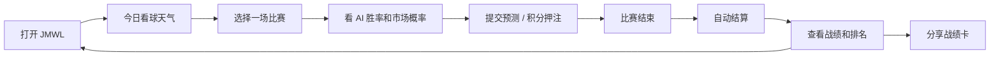

# JMWL World Cup 世界杯窗口期产品与推广 PRD

版本：2026-06-14.1  
状态：执行方案草案  
周期：2026-06-14 至 2026-07-19  
产品口号：赛前有底，赛后有谱

## 1. Summary

这份文档解决一个问题：

> 世界杯期间，JMWL 不只是做一个看板，而是如何让用户每天有理由打开、预测、复盘、分享，并最终沉淀成可展示的产品实习项目数据。

核心判断：

> 先用“预测准不准”形成最小闭环，再用积分、排行榜、AI 复盘和分享内容放大传播。

世界杯只是冷启动窗口。真正要验证的是：用户是否愿意在看球前使用 JMWL 获取策略参考，并在赛后回来查看自己和 AI 的表现。

## 2. 背景

### 2.1 世界杯时间窗口

根据 FIFA 官方赛程信息，2026 世界杯从 6 月 11 日开始，决赛在 7 月 19 日。FIFA 官方页面说明从 6 月 11 日第一声哨响到 7 月 19 日决赛期间，赛程和结果会持续更新。  
来源：[FIFA Match schedule](https://www.fifa.com/en/tournaments/mens/worldcup/canadamexicousa2026/articles/match-schedule-fixtures-results-teams-stadiums)

按公开赛程拆分：

- 小组赛：6 月 11 日 - 6 月 27 日。
- 32 强：6 月 28 日 - 7 月 3 日。
- 16 强：7 月 4 日 - 7 月 7 日。
- 1/4 决赛：7 月 9 日 - 7 月 11 日。
- 半决赛：7 月 14 日 - 7 月 15 日。
- 三四名：7 月 18 日。
- 决赛：7 月 19 日。  
来源：[Sky Sports World Cup key dates](https://www.skysports.com/football/news/11095/13481245/world-cup-2026-fixture-schedule-and-uk-kick-off-times-day-by-day-breakdown-of-all-104-matches-including-england-scotland)

这意味着产品还有约一个月窗口，可以完成：

- 小组赛阶段：用户冷启动和预测习惯建立。
- 淘汰赛阶段：排行榜竞争和社交分享放大。
- 决赛阶段：做最终战报、模型成绩、用户战绩和简历复盘。

### 2.2 当前产品基础

项目已经具备：

- 世界杯 104 场赛程。
- 比赛详情页。
- AI 胜率和本地模型。
- Polymarket 市场概率。
- 用户登录。
- 胜平负预测保存。
- 新增积分、排行榜、奖励相关后端雏形。

但还缺少完整日活闭环：

```text
看策略 -> 做预测 -> 赛后结算 -> 看战绩 -> 看排名 -> 再回来预测
```

## 3. Objective

### 3.1 终局目标

到 2026 年 7 月 19 日世界杯决赛后，JMWL 至少要拿到一条完整的产品故事：

> 我们将一个 AI 世界杯预测看板，迭代成了一个“赛前预测 + 积分竞技 + 赛后复盘”的 AI 看球产品；通过小规模用户运营，验证用户会在比赛前查看策略、提交预测，并在赛后回来看战绩和排名。

### 3.2 产品目标

1. 让用户每天打开网站有明确理由。
2. 让用户从“看数据”变成“做一次预测行为”。
3. 让用户赛后回来查看结果。
4. 用排行榜和分享卡制造传播。
5. 为产品实习求职沉淀真实数据和复盘材料。

### 3.3 核心成功指标

不要先追求大 DAU。更重要的是链路转化。

| 指标 | MVP 目标 | 意义 |
| --- | --- | --- |
| 策略页访问用户 | 50-200 | 证明触达和兴趣 |
| 注册用户 | 20-80 | 证明用户愿意留下身份 |
| 预测提交数 | 50-300 | 证明核心行为成立 |
| 人均预测数 | >2 | 证明不是一次性使用 |
| 赛后复盘查看率 | >20% | 证明用户会回来 |
| 排行榜查看率 | >20% | 证明竞争心有效 |
| 分享卡使用数 | 5-30 | 证明传播潜力 |
| 用户文字反馈 | 10+ 条 | 证明能做产品复盘 |

## 4. Market Segments

### 4.1 第一类：普通看球用户

用户想法：

> 我今晚想看球，但我不知道哪场值得看，也不知道谁更有机会。

产品给他：

- 今日值得看的比赛。
- 简单胜率。
- AI 一句话解释。
- 预测入口。

核心价值：

> 看球前有底。

### 4.2 第二类：喜欢竞猜/预测的用户

用户想法：

> 我想猜一下，但我希望有数据参考，也想知道自己准不准。

产品给他：

- 胜平负预测。
- 积分押注。
- 战绩统计。
- 排行榜。
- 赛后复盘。

核心价值：

> 猜完有结果，结果有排名。

### 4.3 第三类：爱讲球/发群的人

用户想法：

> 我想在群里讲得像个懂球的人。

产品给他：

- 今日看球天气。
- AI 讲球话术。
- 赛后战绩卡。
- 用户画像：稳健派、搏冷派、反共识派。

核心价值：

> 不只是看球，还能讲球。

## 5. Value Proposition

### 5.1 一句话价值

> JMWL 让用户在世界杯期间每天都有一张“看球天气图”：赛前知道哪场值得看，赛中知道自己押了什么，赛后知道自己准不准。

### 5.2 为什么不是普通看板

普通看板：

```text
用户打开 -> 看胜率 -> 关闭
```

JMWL：

```text
用户打开 -> 看今日策略 -> 提交预测 -> 赛后结算 -> 看战绩和排名 -> 分享 -> 第二天再来
```

关键差异是：**JMWL 让用户留下行为和结果。**

### 5.3 为什么不是下注平台

JMWL 不碰真钱。

产品表达必须是：

- 模拟积分。
- 娱乐预测。
- AI 分析。
- 看球复盘。

不能表达成：

- 推荐下注。
- 保证盈利。
- 带单。
- 投注平台。

## 6. Core Product Loop

### 6.1 每日使用闭环



### 6.2 用户每天打开的理由

主理由：

> 看自己预测准不准。

辅助理由：

1. 今天有哪些比赛值得看。
2. AI 今天看好谁。
3. 我的积分有没有涨。
4. 我在排行榜第几。
5. 昨天 AI 和我谁更准。
6. 有没有适合发群的战绩卡。

### 6.3 现阶段玩法选择

推荐选择：

> A 为主，C 为辅，B 暂缓。

解释：

- A：看自己预测准不准，是最短闭环，最适合一个月内跑数据。
- C：排行榜能增强竞争和复访，但需要一定用户量。
- B：和 AI 聊比赛有差异化，但开发成本高，短期不适合作为主闭环。

所以 MVP 应该先做：

```text
预测竞技闭环 + AI 赛前解释 + AI 赛后复盘
```

不要先做：

```text
大型 AI 聊天室 / 全功能看球社区
```

## 7. Solution

### 7.1 必须上线的 P0 功能

#### 功能一：今日看球天气

入口：`/strategy` 或首页核心模块。

内容：

- 今日比赛。
- 推荐关注等级：S / A / B / 观望。
- AI 一句话解释。
- 市场概率和模型概率分歧。
- 进入预测按钮。

目标：

> 用户打开后 10 秒内知道今晚该看哪场。

#### 功能二：预测 + 积分押注

在比赛详情页加：

- 胜平负预测。
- 积分滑块。
- 预计收益。
- 锁盘提示。
- 提交后进入“我的预测”。

目标：

> 用户不只是看胜率，而是做出一次可结算的预测行为。

#### 功能三：赛后结算

新增 `/api/settle`。

逻辑：

- 找到已开赛/已结束且未结算的预测。
- 根据真实赛果判断主胜/平/客胜。
- 更新预测状态。
- 更新积分。
- 写入积分流水。

目标：

> 用户预测后能得到明确反馈。

#### 功能四：个人战绩

在 `/profile` 或 `/predictions` 展示：

- 累计预测。
- 已结算场次。
- 命中数。
- 命中率。
- 当前积分。
- 连续命中。
- 最近 5 场结果。

目标：

> 用户知道自己到底准不准。

#### 功能五：排行榜

已有 `/leaderboard` 雏形，需要验证和强化。

展示：

- 积分榜。
- 准确率榜。
- 我的排名。
- 前三名突出展示。

目标：

> 用户有竞争和炫耀理由。

### 7.2 P1 增长功能

#### 分享卡

生成内容：

- 今日预测战绩。
- 我的命中率。
- 我的排行榜名次。
- AI 一句话点评。

示例：

> 昨晚我在 JMWL 预测 3 场，中了 2 场。  
> 当前积分 860，排名第 7。  
> AI 说我是“稳健派看球人”。

#### 每日战报

每天产出一条运营内容：

- 昨日 AI 战绩。
- 昨日用户命中榜。
- 今日最值得看的 3 场。
- 今日最大分歧盘。

#### 用户画像

先做简单版：

- 稳健派：常选高胜率方向。
- 搏冷派：常选低概率方向。
- 反共识派：常选市场低估方向。
- 主队信仰派：总选自己喜欢的队。

## 8. 世界杯阶段运营计划

### 8.1 小组赛：6 月 14 日 - 6 月 27 日

目标：

> 拉新、让用户提交第一次预测。

主打内容：

- 今日看球天气。
- 今日 3 场值得看。
- AI 最看好的一场。
- 市场和模型分歧最大的一场。

每天运营动作：

1. 中午/下午发布“今晚看球天气”。
2. 比赛前 1-3 小时发布具体比赛策略。
3. 第二天发布“昨日预测战报”。

推荐渠道：

- 朋友圈。
- 微信群。
- 小红书。
- B 站动态。
- 同学群/球迷群。

内容模板：

```text
今晚世界杯有 X 场，但 JMWL 只推荐重点看 3 场：

1. A vs B：实力盘，模型看好 A
2. C vs D：分歧盘，市场和模型差 6pt
3. E vs F：娱乐盘，适合搏冷

我把 AI 胜率和预测入口放这里：
[链接]
```

### 8.2 32 强和 16 强：6 月 28 日 - 7 月 7 日

目标：

> 强化淘汰赛紧张感，让排行榜变得重要。

主打内容：

- 输了就回家。
- AI 是否看好冷门。
- 用户命中榜。
- 谁是淘汰赛预言家。

产品重点：

- 排行榜露出。
- 我的排名。
- 连胜提示。
- 分享卡。

内容模板：

```text
淘汰赛开始，JMWL 预测榜也进入真刀真枪阶段。

昨晚最高命中用户：X
AI 命中：X/Y
今日最大冷门风险：A vs B

你可以先预测，再看自己明天排第几。
```

### 8.3 1/4 决赛和半决赛：7 月 9 日 - 7 月 15 日

目标：

> 做社交传播和产品声量。

主打内容：

- 大战前瞻。
- AI 模型和市场分歧。
- 用户阵营对抗。
- 榜首争夺。

产品重点：

- 分享卡必须可用。
- 今日焦点页必须清晰。
- AI 赛后复盘要像人话。

内容模板：

```text
今晚这场不是普通强强对话。

市场更看好 A，但 JMWL 模型认为 B 的反击效率被低估。
当前用户预测阵营：
A 胜：42%
平局：23%
B 胜：35%

你站哪边？
```

### 8.4 三四名和决赛：7 月 18 日 - 7 月 19 日

目标：

> 做最终收割：平台战报、用户战报、模型战报、简历成果。

必须产出：

1. JMWL 世界杯预测总战报。
2. AI 模型准确率。
3. 用户总预测数。
4. 用户排行榜。
5. 最强用户画像。
6. 世界杯后继续覆盖欧冠/英超的预告。

内容模板：

```text
JMWL 世界杯总战报：

累计用户：X
累计预测：X
AI 命中率：X%
用户最高命中率：X%
最强预言家：X
最常见用户画像：稳健派

世界杯结束，但 JMWL 会继续覆盖欧冠和英超焦点战。
```

## 9. 数据和埋点

### 9.1 必须记录的事件

```text
strategy_page_view
match_card_view
prediction_submit
wager_submit
settlement_view
leaderboard_view
profile_stats_view
share_card_click
daily_checkin_click
```

### 9.2 每天要看的数据

| 指标 | 问题 |
| --- | --- |
| 策略页 PV/UV | 今天有多少人被内容吸引 |
| 比赛卡点击率 | 用户是否愿意深入看 |
| 注册转化率 | 用户是否愿意留下身份 |
| 预测提交率 | 核心行为是否成立 |
| 人均预测数 | 用户是否多次参与 |
| 结算页回访率 | 用户是否关心结果 |
| 排行榜点击率 | 竞争机制是否有效 |
| 分享点击率 | 是否有传播潜力 |

### 9.3 产品实习项目表达

最终项目应该这样讲：

> 我在世界杯期间设计并上线 AI 看球策略产品，通过“赛前策略 - 积分预测 - 赛后结算 - 排行榜”构建日活闭环；用事件埋点追踪策略页访问、预测提交、结算回访和排行榜点击，并基于数据优化入口和策略文案。

如果拿到数据，可以写：

> 运营 X 天，触达 X 名用户，获得 X 次预测提交，人均预测 X 次，赛后回访率 X%，排行榜点击率 X%。

## 10. 推广打法

### 10.1 推广原则

不要直接说：

> 我做了一个网站，大家来看看。

要说：

> 今晚这场球，AI 和市场分歧很大，你站哪边？

内容先行，产品承接。

### 10.2 每日内容节奏

| 时间 | 内容 | 目的 |
| --- | --- | --- |
| 中午 | 今日看球天气 | 预热 |
| 赛前 1-3 小时 | 单场策略卡 | 转化预测 |
| 赛后/次日 | 昨日战报 | 拉回访 |
| 每 3-5 天 | 排行榜更新 | 刺激竞争 |

### 10.3 渠道策略

#### 微信群

适合冷启动。

话术：

```text
我做了个世界杯 AI 看球工具，今晚先测这一场。
你们可以先预测，明天看谁准。
```

#### 朋友圈

适合展示结果。

内容：

- 今日看球天气图。
- 自己预测战绩。
- 排行榜截图。

#### 小红书

适合包装成轻内容：

- 世界杯今晚看哪场？
- AI 看球天气。
- 普通人怎么看懂赔率？
- 我用 AI 预测世界杯，结果如何？

#### B 站动态/视频

适合做复盘：

- 用 AI 和 Polymarket 预测世界杯。
- 昨晚 AI 预测翻车了吗？
- 世界杯预测排行榜挑战。

## 11. 一个月开发优先级

### Week 1：闭合核心玩法

目标：

> 用户可以预测、结算、看战绩、看排行。

任务：

1. 每日签到 UI。
2. 积分押注滑块。
3. `/api/settle` 赛后结算。
4. 个人战绩展示。
5. 排行榜验证。

### Week 2：做增长传播

目标：

> 用户可以分享，朋友可以进入。

任务：

1. 分享卡。
2. 每日精选 Top 3/Top 5。
3. 排行榜高亮我的排名。
4. 邀请或分享来源记录。
5. 基础 SEO。

### Week 3：做可信度

目标：

> 用户相信这个工具不是随口胡说。

任务：

1. AI 命中率仪表盘。
2. 市场 vs 模型历史对照。
3. 用户预测统计。
4. 每周战报。

### Week 4：做收割材料

目标：

> 形成黑客松/简历/作品集材料。

任务：

1. 世界杯阶段战报。
2. 项目 Demo 视频。
3. 数据复盘页。
4. 产品复盘文档。
5. 世界杯后欧冠/英超预告。

## 12. 风险和取舍

### 风险一：做太多，核心闭环没跑起来

取舍：

> 先做预测、结算、战绩、排行榜。AI 聊天和商城都可以后置。

### 风险二：用户不愿注册

取舍：

> 游客可看策略，但预测、积分、排名必须登录。

### 风险三：赛果结算不完整

取舍：

> MVP 可以先半自动录入赛果，先跑通链路。

### 风险四：像博彩

取舍：

> 全部用积分和模拟预测表达，不碰真钱。

### 风险五：世界杯结束后流量消失

取舍：

> 决赛前就预告“世界杯后继续覆盖欧冠/英超焦点战”，不要等结束后再转型。

## 13. 最终建议

世界杯窗口期产品策略应该是：

> 用“预测准不准”建立日活理由，用“排行榜”制造竞争，用“AI 复盘”形成差异化，用“分享卡”完成传播。

不要把 JMWL 做成一个静态看板。

它应该在世界杯期间每天推动用户完成一个动作：

```text
今天预测一场，明天回来看看准不准。
```

这就是最小但有力的日活循环。

